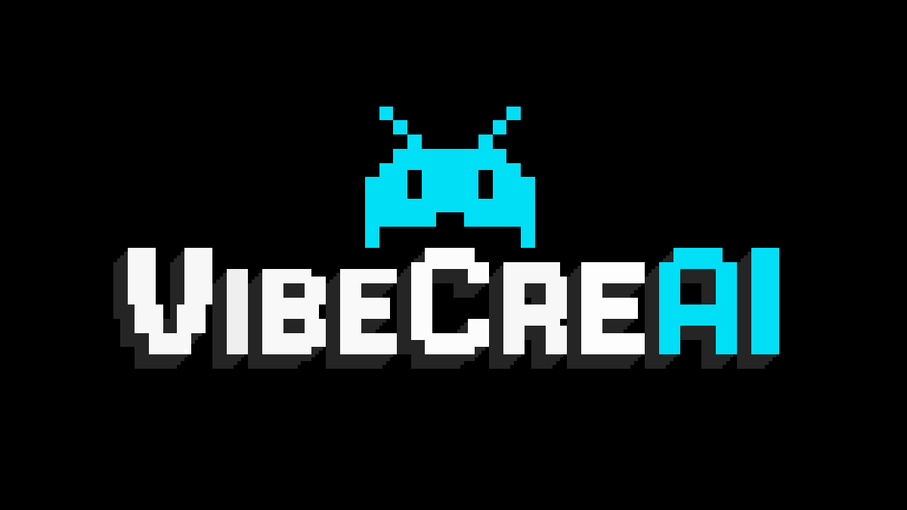

# VibeCreAI Website 🚀✨

> *Where creativity meets artificial intelligence*



A stunning personal portfolio website showcasing the power of **AI-human collaboration** in web development. This open source project demonstrates what's possible when creativity meets cutting-edge AI tools, built through the partnership between human imagination and artificial intelligence.

## 🔄 Recent Updates & Status (2025)

### Latest Improvements
- ✅ **Modular Architecture**: Transitioned from single-file to organized CSS/JS modules for better maintainability
- ✅ **Enhanced UI/UX**: 
  - Updated navigation from "PROJECTS" to "APPS" for clarity
  - Standardized button widths for visual consistency  
  - Removed black text shadows from game buttons for cleaner appearance
  - Improved loading screen with white text for better contrast
- ✅ **Performance Optimizations**: Advanced 3-phase optimization system in Vibe Survivor game
- ✅ **Code Quality**: Better separation of concerns and improved documentation
- ✅ **Mobile Experience**: Enhanced touch controls and responsive design across all features

### Current Status
- 🟢 **Fully Operational**: All features including both games working perfectly
- 🟢 **Cross-Platform**: Works on desktop, tablet, and mobile devices
- 🟢 **Performance**: Maintains 60fps target across all devices
- 🟢 **SEO Ready**: Complete meta tags and social media optimization
- 🟢 **Production Ready**: Stable deployment on Vercel with custom domain

## 🌟 Key Features

### 🎨 **Interactive UI**
- **Progressive Theme Switcher**: 4 unique visual themes (Default, Synthwave, Matrix, Ghost)
- **Source Code Terminal**: Click the tagline to explore the project's story progressively
- **Neural Network Animation**: Dynamic canvas background with particle effects
- **Matrix Rain Effect**: Iconic digital rain animation
- **Custom Cursor System**: Smooth, animated cursor with interactive feedback

### 🖥️ **Progressive Content Discovery**
- **4-Section Story**: Learn about the project through interactive terminal
  1. **About This Project** - The AI collaboration story
  2. **Tech Stack** - Technical implementation details  
  3. **The Vibe Code** - Development philosophy
  4. **Get The Source** - Repository and contact information

### 🎮 **Hidden Interactive Games**
- **Vibe Runner Game**: Complete side-scrolling endless runner with obstacles, power-ups, and progressive difficulty
- **Vibe Survivor Game**: Advanced survival/defense game with:
  - **Multiple Weapon Systems**: Basic projectiles, spread shots, laser beams, plasma weapons, shotgun blasts, lightning bolts, flame streams, homing missiles, railgun beams, and boss missiles
  - **Enemy Variety**: Standard enemies, fast runners, tanks, shooters, and epic boss battles with minions
  - **Progressive Gameplay**: Level-up system with weapon upgrades and passive abilities
  - **Visual Effects**: Screen shake, particle systems, explosions, critical hit effects, and trail multipliers
  - **Mobile Optimized**: Touch controls, virtual joystick, and responsive UI
  - **Performance Optimizations**: Object pooling, enhanced frustum culling, batch rendering, adaptive quality scaling
- **Interactive Elements**: Hover effects and micro-animations throughout
- **Dynamic Taglines**: Rotating inspirational messages

### 🎨 Advanced Animations
- **Anime.js Integration** - Professional-grade animations
- **Text Scramble Effects** - Dynamic text scrambling animations
- **Smooth Scroll Animations** - IntersectionObserver-based fade-ins
- **Staggered Animations** - Sequential element animations
- **Parallax Effects** - Mouse-following parallax on hero section
- **Glow Hover Effects** - Neon glow animations on interactive elements

### 📱 **Modern Design & Performance**
- **Fully Responsive**: Optimized for mobile, tablet, and desktop with adaptive layouts
- **Mobile-First Games**: Touch controls, virtual joysticks, and gesture support
- **Accessibility Focused**: WCAG compliant with keyboard navigation and screen reader support
- **Performance Optimized**: 60fps animations, object pooling, and efficient rendering
- **Cross-Browser Compatible**: Works across all modern browsers (Chrome, Firefox, Safari, Edge)
- **Progressive Enhancement**: Core functionality works without JavaScript

## 🤖 **AI Collaboration Story**

This website is a testament to what's possible when creativity meets AI collaboration. Every line of code was written through the partnership between human imagination and artificial intelligence, specifically using **Claude** and **Cursor IDE**.

The site represents not just a portfolio, but a philosophy: *You don't need to be a coding expert to build something amazing. You just need ideas, determination, and the right AI partner.*

### The Development Process:
- **Ideation**: Human creativity and vision
- **Implementation**: AI-assisted coding and problem-solving  
- **Refinement**: Iterative improvement through AI feedback
- **Optimization**: AI-powered performance enhancements

### 🎯 Premium User Experience
- **Dual-Platform App Buttons** - Separate Web and Android app links
- **Enhanced Logo Interactions** - Animated logo with underline effects
- **Section Title Hover Effects** - Interactive glowing animations
- **Newsletter Integration** - Animated subscription form
- **Status Badge System** - Live/Soon/Dev status indicators
- **iOS Coming Soon Notice** - User-friendly platform availability info

### 🚀 Technical Excellence
- **High Performance** - Multi-phase optimization system with 60fps target rendering
- **Canvas-Based Games** - Hardware-accelerated game graphics with dynamic effects
- **Responsive Canvas** - Dynamic canvas sizing and node optimization for all devices  
- **Advanced Game Optimizations**:
  - **Object Pooling** - Memory-efficient projectile and particle management system
  - **Enhanced Frustum Culling** - Intelligent off-screen entity rendering optimization
  - **Adaptive Quality Scaling** - Automatic performance-based quality adjustment
  - **Batch Rendering** - GPU-efficient grouped rendering for similar entities
- **Screen Shake System** - Immersive feedback for game impacts and explosions
- **Trail Multipliers** - Visual enhancement system for weapon effects
- **Mobile Touch Controls** - Intuitive virtual joystick and touch interaction system
- **SEO Optimized** - Complete meta tags, sitemap, and semantic HTML structure
- **Social Media Ready** - Open Graph and Twitter Card integration with preview images

## 🛠️ Tech Stack

```javascript
const techStack = {
    "frontend": ["HTML5", "CSS3", "JavaScript ES6+"],
    "animations": "Anime.js",
    "graphics": "Canvas API",
    "effects": [
        "Neural Network Canvas Animation",
        "Matrix Rain Effect", 
        "Particle Systems",
        "Custom Cursor",
        "Screen Shake Effects",
        "Trail Multipliers"
    ],
    "games": [
        "Vibe Runner (Side-scrolling)",
        "Vibe Survivor (Survival/Defense)"
    ],
    "architecture": "Single-page application with modular game components",
    "ai_tools": ["Claude", "Cursor IDE"],
    "deployment": "Vercel with custom domain"
};
```

### Technical Details:
- **HTML5** - Semantic markup with modern standards and accessibility
- **CSS3** - Modular architecture with organized stylesheets, custom properties, and responsive design
- **Vanilla JavaScript** - ES6+ modular components with class-based architecture and event-driven design
- **Canvas API** - Hardware-accelerated background effects and game rendering with performance optimizations
- **Anime.js** - Professional animation library for smooth transitions and effects
- **Vercel** - High-performance deployment with CDN optimization and custom domain
- **Modular Architecture** - Organized separation of concerns with dedicated CSS and JS modules

## 📦 Project Structure

```
vibecreai-website/
├── index.html              # Main website entry point
├── README.md               # Project documentation
├── CLAUDE.md               # Claude Code development guidelines
├── vercel.json             # Vercel deployment configuration
├── LICENSE                 # MIT License
├── CNAME                   # Custom domain configuration
├── sitemap.xml             # SEO sitemap
├── robots.txt              # Search engine directives
├── app-ads.txt             # App ads configuration
├── .gitignore              # Git ignore rules
├── js/                     # JavaScript modules (modular architecture)
│   ├── game-manager.js     # Game coordination and state management
│   ├── main.js             # Core application logic and animations
│   ├── menu-handler.js     # Navigation and menu interactions
│   ├── performance-utils.js # Performance monitoring utilities
│   ├── pixel-hover.js      # Pixel art hover effects
│   ├── pixel-maze-background.js # Dynamic maze background
│   ├── terminal.js         # Terminal interface functionality
│   ├── theme-switcher.js   # Theme system management
│   ├── vibe-runner-game.js # Side-scrolling endless runner game
│   ├── vibe-survivor-game.js # Advanced survival/defense game (8500+ lines)
│   │                       # Includes multi-phase performance optimization system
│   └── components/         # Reusable component modules
├── styles/                 # Modular CSS architecture
│   ├── base.css           # Base styles and layout
│   ├── themes.css         # Theme color definitions  
│   ├── animations.css     # Animation definitions
│   ├── components.css     # Component-specific styles
│   ├── responsive.css     # Mobile and responsive styles
│   └── pixel-hover.css    # Pixel art hover effects
├── images/                 # Image assets folder
│   ├── favicon.png         # Website favicon
│   ├── og_image.png        # Open Graph social sharing image
│   ├── spin2pick_icon.png  # Spin2Pick app icon
│   ├── AI_collaboration.png # AI collaboration showcase image
│   ├── Vibe_Runner.png     # Vibe Runner game preview
│   └── Vibe_Survivor.png   # Vibe Survivor game preview
├── sound/                  # Audio assets folder (for future game audio)
└── fonts/                  # Custom font files
    └── Born2bSportyFS.otf  # Custom display font
```

## 🚀 Live Demo

**🔗 [Visit VibeCreAI Website](https://vibecreai.com)**

> *Experience the hidden games by double-clicking on interactive elements!*

## 🚀 Quick Start

### Prerequisites
- Modern web browser
- Basic text editor (VS Code recommended)  
- Git (for cloning)

### Installation

1. **Clone the repository**
   ```bash
   git clone https://github.com/VibeCreAI/vibecreai-website.git
   cd vibecreai-website
   ```

2. **Open in browser**
   ```bash
   # Simply open index.html in your preferred browser
   open index.html  # macOS
   start index.html # Windows
   xdg-open index.html # Linux
   ```

3. **Or serve locally** (optional)
   ```bash
   # Using Python 3
   python -m http.server 8000
   
   # Using Node.js
   npx serve .
   
   # Then visit http://localhost:8000
   ```

## 🎨 Cyberpunk Color Palette

- **Primary Cyan**: `#00ffff` - Main neon accent color
- **Secondary Magenta**: `#ff00ff` - Complementary neon color
- **Accent Blue**: `#2bb4db` - Supporting brand color
- **Dark Background**: `#0a0a0a` - Deep black theme
- **Text Color**: `#ffffff` - Pure white for contrast
- **Android Green**: `#4CAF50` - For Android app buttons
- **Glow Effects**: Multiple rgba variations for neon lighting

## 🏗️ Deployment

This website is deployed using [Vercel](https://vercel.com/) with automatic deployments on every git push to main branch.

### Deployment Configuration
- **Platform**: Vercel with CDN optimization
- **Domain**: Custom domain `vibecreai.com` configured via CNAME
- **Auto-Deploy**: Automatic deployments triggered by git push to main
- **Build Process**: No build required - static file serving
- **Performance**: Optimized with Vercel's edge network

### Configuration Files
- `vercel.json` - Vercel routing rules and deployment settings
- `CNAME` - Custom domain configuration  
- `robots.txt` - Search engine crawling directives
- `sitemap.xml` - SEO site structure mapping

## 📱 Product Showcase

### Current Products
- **Spin2Pick** - AI-powered activity picker for kids with intelligent suggestions
  - 🌐 **Web App**: Available at [spin2pick-app.vercel.app](https://spin2pick-app.vercel.app/)
  - 📱 **Android App**: Available on [Google Play Store](https://play.google.com/store/apps/details?id=com.vibecreai.spin2pick&pli=1)
  - 🍎 **iOS App**: Coming Soon!

### Upcoming Products
- **AI Games** - Next-generation gaming experiences powered by artificial intelligence (Coming Soon)
- **Smart Tools** - Revolutionary AI tools for creative professionals and developers (In Development)
- **Creative Platforms** - AI-enhanced design and collaboration tools (Planning)

## 🔧 Development

### Local Development
1. Clone this repository
2. Open `index.html` in your preferred browser
3. For live reload, use a local server:
   ```bash
   # Python 3
   python -m http.server 8000
   
   # Node.js
   npx serve .
   
   # Windows PowerShell (as mentioned in CLAUDE.md)
   python -m http.server 8000
   # Then visit http://localhost:8000
   ```

### Development Workflow (from CLAUDE.md)
```powershell
# Check status
git status

# Add changes
git add .

# Commit with descriptive message
git commit -m "feat: description of changes"

# Deploy (auto-deploys via Vercel)
git push origin main
```

## 🚀 Performance Optimization

### Multi-Phase Optimization System
The Vibe Survivor game includes a comprehensive 3-phase performance optimization system:

#### Phase 1: Object Pooling ✅
- **Memory Management**: Efficient projectile and particle reuse system
- **Garbage Collection**: Minimized memory allocation/deallocation cycles
- **Pool Size**: Dynamic scaling based on gameplay intensity

#### Phase 2: Enhanced Frustum Culling ✅
- **Viewport Optimization**: Only renders entities visible on screen
- **Collision Detection**: Optimized hit detection for visible entities only
- **Performance Gain**: 30-50% improvement with many off-screen entities

#### Phase 3: Advanced Rendering ✅
- **Adaptive Quality Scaling**: Automatic quality adjustment based on FPS performance
- **Quality Levels**: High (60+ FPS), Medium (45-60 FPS), Low (30-45 FPS)
- **Performance Monitoring**: Real-time FPS tracking and automatic adjustment
- **Fallback Systems**: Graceful degradation when advanced features fail

### Future-Proofing Guidelines
When adding new weapons, enemies, or visual effects:

1. **New Weapons**: Use existing object pooling system for projectiles
2. **New Enemies**: Implement `shouldRender()` method for frustum culling
3. **Visual Effects**: Consider performance impact and adaptive quality scaling
4. **Mobile Testing**: Always test on mobile devices with touch controls

### Performance Monitoring
- **FPS Counter**: Built-in performance monitoring in development mode
- **Quality Scaling**: Automatic adjustment system maintains smooth gameplay
- **Memory Usage**: Object pooling prevents memory leaks during extended gameplay

### Making Changes
- **Main Site**: All core styles and scripts are contained within `index.html` for simplicity
- **Games**: Modular JavaScript files in `/js/` directory for game logic
- **Assets**: Images in `/images/`, fonts in `/fonts/`, sounds in `/sound/`
- **Code Style**: Follow existing patterns - ES6+ classes, camelCase variables, extensive event listeners
- **Performance**: Always test canvas animations at 60fps and ensure mobile responsiveness
- **Games**: Test both Vibe Runner and Vibe Survivor on mobile and desktop

## 🎯 SEO & Social Media

### Meta Tags
- Complete Open Graph implementation
- Twitter Card integration
- Comprehensive meta descriptions and keywords

### Performance
- Optimized images (WebP where possible)
- Minimal external requests
- Efficient CSS and JavaScript

## 📈 Analytics

The website includes Google AdSense integration with the publisher ID configured in the head section.

## 🤝 Contributing

Contributions are welcome! This project embraces the **AI-human collaboration** philosophy.

### How to Contribute
1. Fork the repository
2. Create a feature branch (`git checkout -b feature/amazing-feature`)
3. Use AI tools to assist your development
4. Commit your changes (`git commit -m 'Add amazing feature'`)
5. Push to the branch (`git push origin feature/amazing-feature`)
6. Open a Pull Request

### Contribution Guidelines
- Document your AI collaboration process
- Include performance considerations
- Test across multiple browsers
- Follow existing code style
- Update README if needed

## 📄 License

This project is licensed under the **MIT License** - see the [LICENSE](LICENSE) file for details.

## 🌟 The Vibe Philosophy

```javascript
function createWithVibes() {
    const passion = "unlimited";
    const codingSkills = "learning";
    const aiAssistance = true;
    
    if (passion === "unlimited" && aiAssistance) {
        return "Amazing things are possible!";
    }
}

// Remember: You don't need to be a coding expert
// to build something amazing. You just need ideas,
// determination, and the right AI partner!
```

## 📬 Contact & Collaboration

**Email**: contact@vibecreai.com  
**GitHub**: [@VibeCreAI](https://github.com/VibeCreAI)  
**Website**: [VibeCreAI Portfolio](https://vibecreai.github.io/vibecreai-website/)

## 🙏 Acknowledgments

- **Claude** - AI development partner
- **Cursor IDE** - AI-powered development environment  
- **Anime.js** - Smooth animations library
- **GitHub Pages** - Free hosting platform
- **Open Source Community** - Inspiration and resources

---

**Built with ❤️ and 🤖 by Samson & Claude**

*This README itself was crafted through AI-human collaboration - demonstrating our core philosophy in action.* 