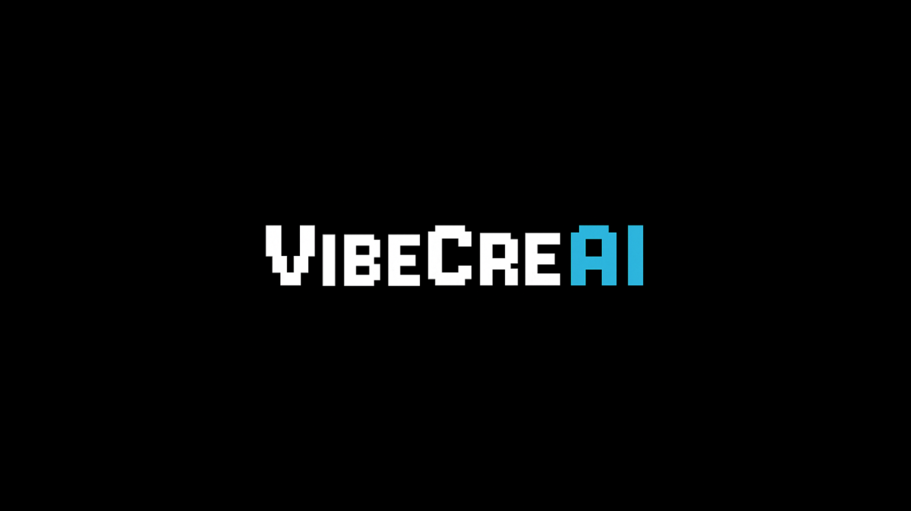

# VibeCreAI 3D Interactive Website 🚀

## 🌟 About This Website

**VibeCreAI** is a unique one-person company that collaborates with multiple AI agents to create innovative AI-powered applications. This website showcases our approach through an immersive 3D interactive experience with cutting-edge web technologies.

**🌐 Visit:** [vibecreai.com](https://vibecreai.com)

---

## 🛠️ Built With AI-Powered Development

This entire website was created using **"vibe coding"** - a collaborative approach between human creativity and AI assistance:

### **Development Stack:**
- **🎯 Cursor IDE** - AI-powered code editor
- **🤖 Claude 4 Sonnet** - AI coding assistant  
- **🎨 Three.js** - 3D graphics and animations
- **⚡ Vanilla JavaScript** - Pure web technologies
- **🎭 Custom 3D Models** - Interactive elements and animations
- **🎵 Web Audio API** - Immersive sound experience
- **🔤 Google Fonts (Orbitron)** - Futuristic typography

### **Development Philosophy:**
Demonstrating the future of software development through human-AI collaboration, where creativity meets cutting-edge AI assistance to build exceptional digital experiences.

---

## ✨ What You'll Experience

### **🎯 Enhanced Navigation System**
- **Smart Responsive Design**: Horizontal menu by default, hamburger only on extreme narrow screens (<320px)
- **Centered Layout**: Clean, professional navigation without logo clutter
- **Orbitron Typography**: Futuristic font throughout the entire website
- **Mobile Optimized**: Perfect experience across all device sizes

### **🎮 Interactive 3D Environment**
- **Smooth Camera Controls** with optimized transitions
- **Card Navigation Arrows**: Browse between Apps/About cards with up/down arrows
- **Keyboard Support**: Arrow keys for seamless navigation
- **Hover Effects**: Refined visual feedback with darker, professional colors

### **🎵 Immersive Audio System**
- **Background Music**: Looping ambient audio for enhanced atmosphere
- **Transition Sound Effects**: Audio feedback for every camera movement
- **Smart Audio Control**: Toggle button with autoplay attempt and graceful fallback
- **Browser Optimized**: Respects autoplay policies while maximizing user experience

### **📱 Professional UX Features**
- **Subscription System** with Google Sheets integration
- **Loading Animations** with progress tracking
- **Dancing Robot Animation** and custom 3D elements
- **Responsive Design** that adapts beautifully to any device
- **Accessibility Focused** with proper contrast and user controls

---

## 🎯 Technical Highlights

### **🔧 Advanced Features:**
- **Vector-based Camera Transitions** for smooth 3D navigation
- **Real-time Audio Management** with volume optimization
- **Mobile Text Rendering** with high-resolution scaling
- **State Management** for navigation and audio systems
- **Error Handling** with graceful fallbacks
- **Performance Optimizations** for all device types

### **🎨 Design Excellence:**
- **Consistent Typography**: Orbitron font across all elements
- **Professional Color Scheme**: Refined hover states and visual feedback
- **Intuitive Navigation**: Smart show/hide logic for UI elements
- **Immersive Experience**: Audio-visual harmony for maximum engagement

---

## 🚀 Recent Updates

### **Latest Release Features:**
- ✅ Complete navigation system overhaul
- ✅ Orbitron font migration for futuristic aesthetic
- ✅ Card navigation arrows with keyboard support
- ✅ Full audio system with background music and sound effects
- ✅ Enhanced mobile responsiveness
- ✅ Improved hover interactions and visual feedback
- ✅ Professional audio controls with smart autoplay

---

## 🎯 Our Mission

Bridging human creativity with AI capabilities to develop cutting-edge applications that enhance productivity, creativity, and user experience. This website itself demonstrates the power of human-AI collaboration in creating exceptional digital experiences.

---

## 📞 Contact

**🌐 Website:** [vibecreai.com](https://vibecreai.com)  
**📧 Email:** contact@vibecreai.com

---

**Made with ❤️ through Human-AI Collaboration**

*Showcasing the future of AI-powered development*

