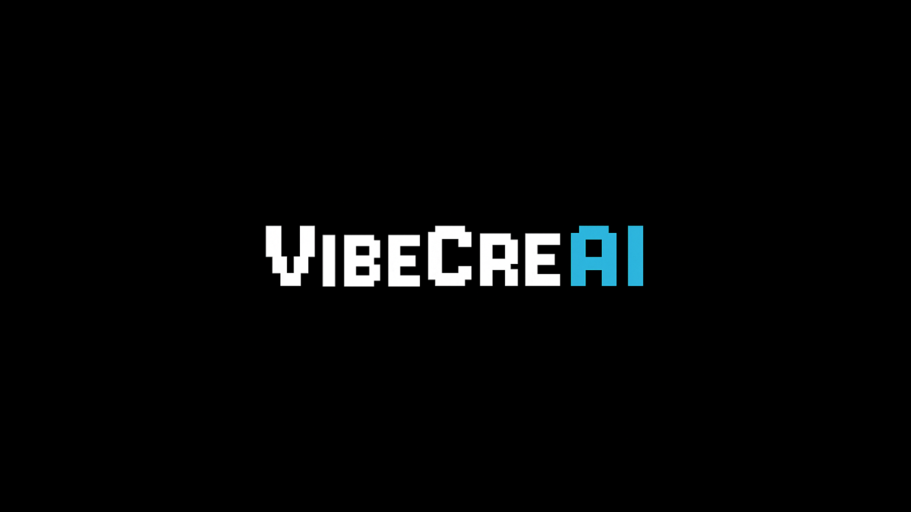

# VibeCreAI Website



A modern, interactive website for VibeCreAI - combining AI technology with human creativity to build innovative games, apps, and creative solutions.

## 🌟 Features

### ✨ Interactive Design
- **Grid Spotlight Effect** - Dynamic grid background that follows mouse movement
- **Smooth Animations** - Fade-in animations and hover effects throughout
- **Particle Effects** - Subtle floating particles for enhanced visual appeal
- **Loading Screen** - Professional loading animation with brand identity

### 📱 Responsive Design
- **Mobile-First Approach** - Optimized for all device sizes
- **Hamburger Menu** - Smooth mobile navigation with scroll lock
- **Adaptive Layout** - Grid systems that adapt to screen sizes
- **Touch-Friendly** - Optimized for touch interactions

### 🎯 User Experience
- **Scroll Progress Bar** - Visual indicator of page scroll progress
- **Newsletter Signup** - Email subscription form for updates
- **Product Status Badges** - Clear visual indicators for product availability
- **Interactive Notifications** - "Notify Me" buttons for upcoming features
- **Smooth Scrolling** - Seamless navigation between sections

### 🚀 Performance
- **Optimized Assets** - Compressed images and efficient CSS
- **Fast Loading** - Minimal external dependencies
- **SEO Optimized** - Comprehensive meta tags and semantic HTML
- **Social Media Ready** - Open Graph and Twitter Card integration

## 🛠️ Technologies Used

- **HTML5** - Semantic markup structure
- **CSS3** - Modern styling with Grid and Flexbox
- **Vanilla JavaScript** - No framework dependencies
- **SVG Graphics** - Scalable vector graphics for the grid pattern
- **Web Fonts** - Custom Born2bSporty font integration

## 📦 Project Structure

```
vibecreai-website/
├── index.html              # Main website file
├── README.md               # Project documentation
├── vercel.json             # Vercel deployment configuration
├── favicon.png             # Website favicon
├── og_image.png            # Open Graph image for social sharing
├── spin2pick_icon.png      # Spin2Pick app icon
├── app-ads.txt             # App ads configuration
├── CNAME.txt               # Custom domain configuration
└── fonts/                  # Custom font files
    └── Born2bSportyFS.otf  # Custom display font
```

## 🚀 Live Demo

Visit the live website: [vibecreai.com](https://vibecreai.com)

## 🎨 Brand Colors

- **Primary Blue**: `#2bb4db` - Main brand color
- **Secondary Blue**: `#1a8ab3` - Darker variant for gradients
- **Background**: `rgba(0, 0, 0, 0.9)` - Dark theme
- **Success Green**: `#28a745` - For positive actions
- **Warning Orange**: `#ffc107` - For coming soon badges

## 🏗️ Deployment

This website is deployed using [Vercel](https://vercel.com/) and configured to serve from the custom domain `vibecreai.com`.

### Vercel Configuration
The `vercel.json` file contains routing rules for proper SPA behavior and custom headers.

### Custom Domain
The `CNAME.txt` file contains the custom domain configuration for GitHub Pages compatibility.

## 📱 Product Showcase

### Current Products
- **Spin2Pick** - Live AI-powered activity picker tool

### Upcoming Products
- **Creative Games** - AI-powered gaming experiences (Coming Soon)
- **Design Platform** - Smart design collaboration tools (Planning)
- **Developer Tools** - AI assistance for developers (Research)

## 🔧 Development

### Local Development
1. Clone this repository
2. Open `index.html` in your preferred browser
3. For live reload, use a local server:
   ```bash
   python -m http.server 8000
   # or
   npx serve .
   ```

### Making Changes
- All styles are contained within `index.html` for simplicity
- The website uses vanilla JavaScript for all interactions
- Images should be optimized before adding to the project

## 🎯 SEO & Social Media

### Meta Tags
- Complete Open Graph implementation
- Twitter Card integration
- Comprehensive meta descriptions and keywords

### Performance
- Optimized images (WebP where possible)
- Minimal external requests
- Efficient CSS and JavaScript

## 📈 Analytics

The website includes Google AdSense integration with the publisher ID configured in the head section.

## 🤝 Contributing

1. Fork the repository
2. Create a feature branch
3. Make your changes
4. Test thoroughly across devices
5. Submit a pull request

## 📄 License

© 2025 VibeCreAI. All rights reserved.

## 🔗 Links

- **Website**: [vibecreai.com](https://vibecreai.com)
- **Spin2Pick Tool**: [vibecreai.com/spin2pick](https://vibecreai.com/spin2pick)
- **Contact**: contact@vibecreai.com

---

**Built with ❤️ using modern web technologies** 
